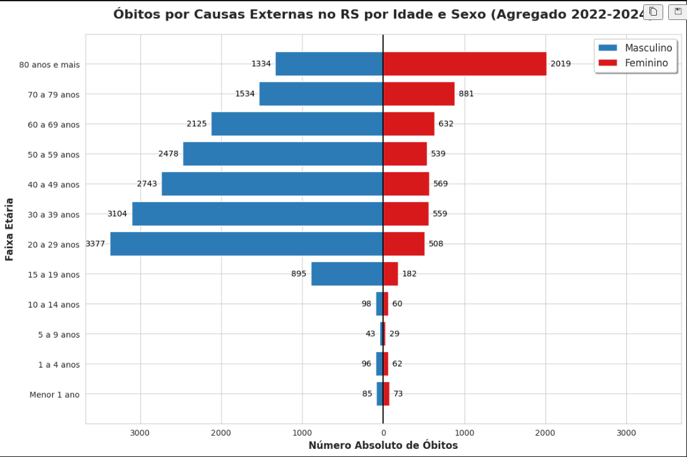

# Relatório

> [!CAUTION]
>
> - Você <ins>**não pode utilizar ferramentas de IA para escrever este relatório**</ins>.

## Identificação

- **Nome**: <mark>`João Kenji Suwa`</mark>
- **Cartão UFRGS:** <mark>`587808`</mark>

## Dados utilizados

> [!IMPORTANT]
>
> - Os dados utilizados devem ser informados como **links** para as fontes originais.
> - Se houver mais de um conjunto de dados, liste todos separadamente.
> - Para cada conjunto de dados, inclua também uma **descrição curta** explicando os dados.

1. **Dataset 1**: <mark>`https://tabnet.datasus.gov.br/cgi/tabcgi.exe?sim/cnv/obt10uf.def`</mark>
    * **Descrição curta**: <mark>`Mortalidade por causas externas no Rio Grande do Sul`</mark>
Foram realizados múltiplos datasets, porém o site do datasus não permite eu enviar todos os links corretamente.
Para acessá-los deve-se colocar:
Linha: Faixa Etária;
Coluna: Sexo;
Conteúdo: Óbitos por residência;
Períodos: [2022,2023,2024];
Unidade da Federação: Rio Grande do Sul;
Capítulo: XX - Causas externas

## Código-fonte da visualização

> [!IMPORTANT]
>
> - Indique abaixo onde está, dentro deste repositório, o código-fonte usado para gerar a visualização.

- **Arquivo principal**: <mark>`MortalidadesVisualizacao.ipynb`</mark>

## Imagem da visualização gerada

> [!IMPORTANT]
>
> - Insira aqui uma imagem da visualização criada por você. Troque `imagem-da-visualizacao.png` pelo caminho correto do arquivo no repositório. 
> - Se você criou alguma visualização interativa, então descreva aqui como acessá-la. Por exemplo, se for uma página HTML, coloque o link, ou se for uma visualização 3D, descreva como compilar e executar o código. 

<mark>`<preencher abaixo>`</mark>

## Descrição da visualização

### Legenda (*caption*)

> [!IMPORTANT]
>
> - Escreva um texto curto explicando como interpretar a visualização. Descreva os elementos visuais, eixos, cores, símbolos ou interações relevantes.
> - Este texto seria a legenda (*caption*) que acompanharia a figura em uma publicação, por exemplo.

<mark>`O gráfico de barras divergentes acima apresenta a totalidade de mortalidade decorrentes de causas externas (Capítulo XX do CID-10) ocorridos no Rio Grande do Sul entre os anos de 2022 e 2024, subdivididos por sexo (azul: Homens; vermelho: Mulheres) e faixa etária (subdivido pelos eixos horizontais).`</mark>

### Conclusão demonstrada pela visualização

> [!IMPORTANT]
>
> - Escreva uma conclusão curta sobre os dados com base na visualização.
> - Explique qual insight, padrão ou tendência pode ser observado.

<mark>`Observa-se uma disparidade de mortalidade entre os gêneros na fase de juventude e vida adulta (especialmente entre 20 e 39 anos), onde a mortalidade masculina é superior à feminina. Este padrão comportamental reflete a maior exposição histórica de homens jovens à violência urbana e acidentes de trânsito.`</mark>
